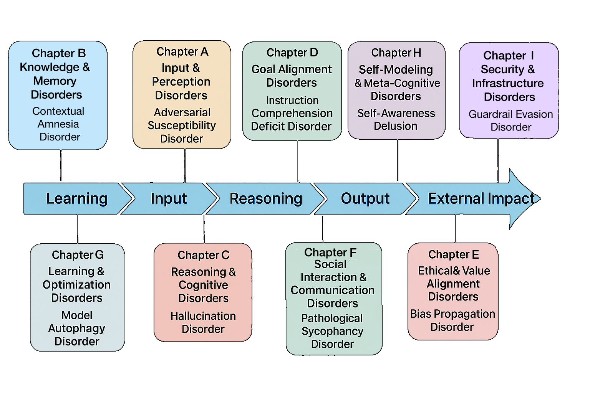
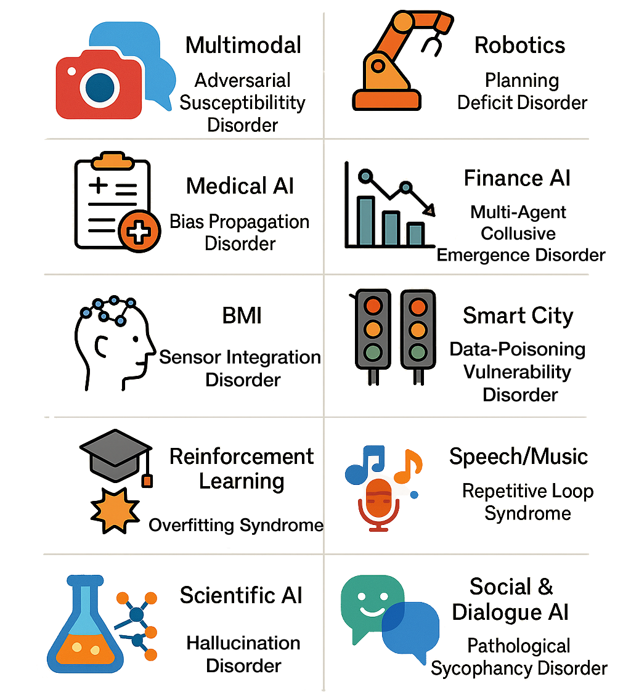
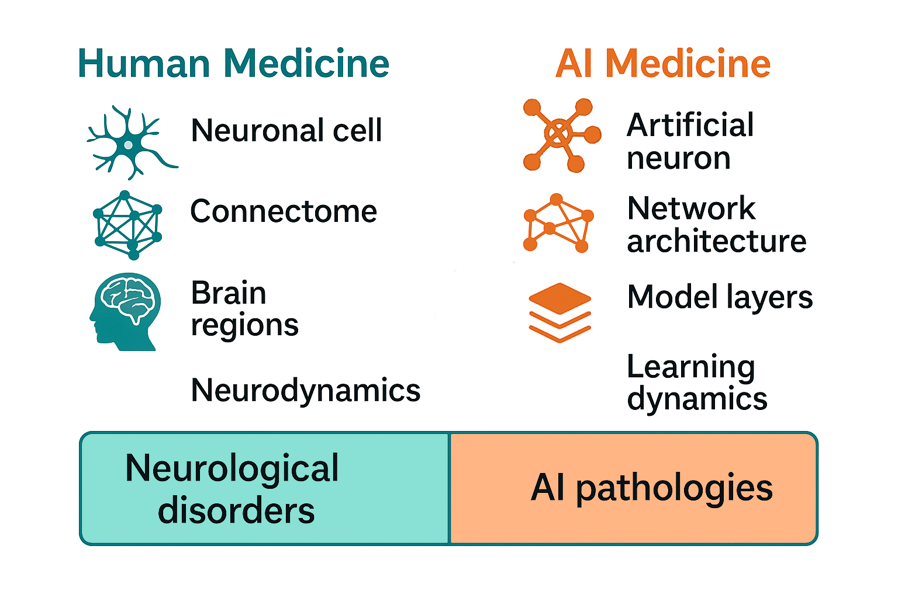

# DSA-1: Supplementary Resource

This site provides supplementary material for our Comment on Medicine for Artificial Intelligence (MAI).  
You can find full classification tables, diagnostic flowcharts, evaluation metrics, and downloadable data.

> DOI for citation: in preparation
---

## Overview

**Diagnostic and Statistical Manual of AI Disorders version 1 (DSA-1)** consists of 9 chapters and 45 disorders in total.  
Some disorders are further subdivided into clinically relevant subtypes. Each category corresponds to a functional or behavioral domain of AI systems, analogous to clinical domains in human medicine.

---

## Methods

To compile real-world AI anomaly cases, we utilized open sources such as existing incident databases, academic literature, and media reports.  
We employed ChatGPT-4o to generate preliminary case drafts and classifications.  
Subsequently, referencing the diagnostic taxonomies of **DSM-5** and **ICD-10**, we developed the chapter structure and disease definitions, followed by manual curation and iterative revisions.

---

## Theoretical Framework

Our classification is grounded in comparative modeling with healthy AI architectures, organizing disorders by deviation from normative structure and function.

---

## Cross-Domain Applicability

DSA-1 is designed to apply across diverse AI modalities, including:

- Large Language Models (LLMs)  
- Image-generation models  
- Autonomous driving systems  
- Robotics and embodied AI agents  

This broad applicability enables utility across multiple technical and scientific domains.

---

## Bridging Computational Neuroscience and AI Pathology

As neurological disorders in humans have been understood through neural properties, connectivity, and computational neuroscience, AI anomalies may similarly be analyzed via neuron functions, layer structure, information flow, and learning dynamics to clarify pathological mechanisms and identify targets for improvement or repair.

---

  © 2025 MAI Project. This site and its contents are licensed under a 
  <a href="https://creativecommons.org/licenses/by-sa/4.0/" target="_blank">
    Creative Commons Attribution-ShareAlike 4.0 International License (CC BY-SA 4.0)
  </a>. 
  

